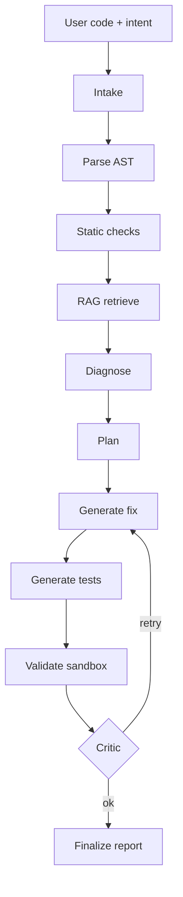

# PythonReviewBot — AI Code Review Copilot

> Paste Python code, tell it what the code should do, get a fixed version with tests, diff, and citations.

PythonReviewBot combines **RAG** over Python best practices with a **LangGraph multi-agent workflow**
(intake → diagnose → plan → generate → validate → critique → finalize) to review and fix Python code.

## Features
- Multi-agent workflow with retry loop and critic
- RAG: ChromaDB + BM25 + Reciprocal Rank Fusion
- Sandboxed validation with Ruff, Mypy, and pytest
- Automatic patch generation + unified diff
- FastAPI, Typer CLI, and Streamlit UI
- Trace of every agent step

## Architecture

## Tech Stack
FastAPI · LangGraph · OpenAI · ChromaDB · BM25 · Rank-BM25 · tiktoken · Pydantic v2 ·
Ruff · Mypy · Pytest · Docker · Streamlit · Typer · Rich · GitHub Actions

## Roadmap
- [ ] GitHub Action that comments PRs
- [ ] Docker-based sandbox for untrusted code
- [ ] RAGAS eval harness
- [ ] Multi-file repo support
- [ ] Local LLM (Ollama) backend

## License
MIT
